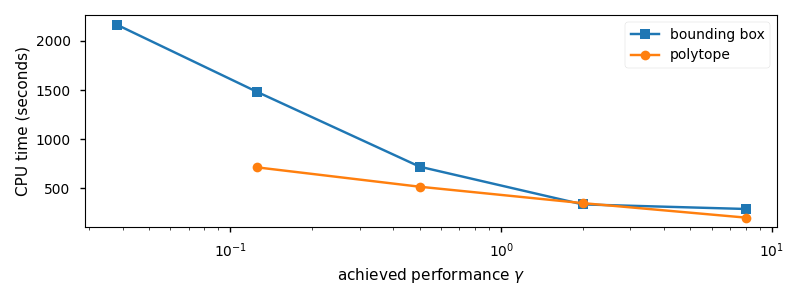

# Motivation

## {data-background-image="pics/cw-Re60-t161-cm-bbw.png" data-background-size="cover"}

. . .

::: {style="position: absolute; width: 60%; right: 0; box-shadow: 0 1px 4px rgba(0,0,0,0.5), 0 5px 25px rgba(0,0,0,0.2); background-color: rgba(0, 0, 0, 0.9); color: #fff; padding: 20px; font-size: 40px; text-align: left;"}
The *Navier-Stokes* equations

$$
\dot v + (v\cdot \nabla) v- \frac{1}{\mathsf{Re}}\Delta v + \nabla p= f, 
$$

$$
\nabla \cdot v = 0.
$$
:::

---

## {data-background-image="pics/cw-Re60-t161-cm-bbw.png" data-background-size="cover"}

::: {style="position: absolute; width: 60%; right: 0; box-shadow: 0 1px 4px rgba(0,0,0,0.5), 0 5px 25px rgba(0,0,0,0.2); background-color: rgba(0, 0, 0, 0.9); color: #fff; padding: 20px; font-size: 40px; text-align: left;"}
Control Problem:

 * use two small outlets for fluid at the cylinder boundary
 * to stabilize the unstable steady state
 * with a few point observations in the wake.

:::

---

## {data-background-image="pics/cw-Re60-t161-cm-bbw.png" data-background-size="cover"}

---

## {data-background-image="pics/cw-v-Re60-stst-cm-bbw.png" data-background-size="cover"}

---

## {data-background-image="pics/frame499_decorated.png" data-background-size="cover"}

---

## {data-background-video="pics/limcyc.MP4"}

# Quadratic Stability

---

The (uncontrolled) Navier-Stokes equations can be realized as an SDC system
\begin{equation}
\dot x(t) = A(x(t))\, x(t), \quad x(0)=x_0 \in \mathbb R^{n},
\end{equation}
with $A\colon \mathbb R^{n}\to \mathbb R^{n\times n}$.

. . .

### Theorem

Quadratic Stability [Prop. 1.1, @Sha12]:  
*If there exists $X>0 \in \mathbb R^{n\times n}$ s. th.
\begin{equation}
XA(x) + A(x)^TX < 0
\end{equation}
along the trajectory $x$, then the system is asymptotically stable.*

---

For $x(t)\in \mathbb R^{n}$, the linear Matrix inequality (LMI)
\begin{equation}
XA(x) + A(x)^TX < 0
\end{equation}
has to be checked on an infinite set $\mathcal X\subset \mathbb R^{n}$.

. . .

For parametrizations $x(t) = \Phi\rho(t)$, with $\rho(t) \in \mathbb R^{r}$, the LMI 
\begin{equation}
XA(\Phi \rho) + A(\Phi \rho)^TX < 0
\end{equation}
has to be checked on an infinite set $\mathcal R \subset R^{r}$.

# Polytopic LPV System Approximations

---

### Theorem

Polytopic LPV systems [@ApkGB95]:    *If $\tilde A(\rho) := A(\Phi\rho)$ is linear, and $\rho(t)\in R\subset \mathbb R^{r}$ with a polytope $R$ of $N$ vertices $\rho^{(i)}$, then **quadratic stability** holds, if 
\begin{equation}
X\tilde A(\rho^{(i)}) + \tilde A(\rho^{(i)})^TX < 0
\end{equation}
at the vertices $\rho^{(i)}$, for $i=1,\dotsc,N$.*

---

Thus, for polytopic LPV systems, we need to solve an 
\begin{equation}
N\cdot n
\end{equation}
dimensional LMI to establish stability.

---

The direct way (like `hinfgs` in Matlab) uses the *bounding box* for $\rho$ and solves a
$$
2^{r+1}\cdot n
$$
dimensional LMI.

--- 

For basic POD (see, e.g., [@HasW11])

\begin{equation}
\dot {\hat x} (t)  = \hat A(\hat x(t))\, \hat x(t), \quad \hat x(0)=\hat x_0 \in \mathbb R^{k}
\end{equation}

the LMI to sizes reduces $2^{k+1}\cdot k$.

However, already for $k=10$, the LMI size is $20\ 480$ despite the low accuracy of the model.

---

Our approach: two level reduction

1. Reduce the state-space to a moderate dimension $k_x$
2. Parametrize the coefficient with very few dimensions $k_r$.

. . .

Then, the system reads
\begin{equation}
\dot {\tilde x} (t)  = \tilde A(\rho(\tilde x(t)))\, \tilde x(t), \quad \tilde x(0)=\tilde x_0 \in \mathbb R^{k_x}, \quad \rho(\tilde x(t)) \in \mathbb R^{k_r},
\end{equation}
and for $k_x=36$ and $k_r=6$, the LMI size is $254$ while accuracy is good.

---

## {data-background-image="pics/jointlimcies.png" data-background-size="cover"}

. . .

::: {style="position: absolute; width: 45%; right: 0; box-shadow: 0 1px 4px rgba(0,0,0,0.5), 0 5px 25px rgba(0,0,0,0.2); background-color: rgba(253, 246, 227, 0.95); padding: 20px; font-size: 40px; text-align: left;"}

Illustration of model accuracy via the limit cycles for

 1. the full order model (top)
 2. the POD reduction with 10 modes (middle)
 3. our two-layer approach (bottom row)

:::

---

## How about further reduction?

Critical factor is $2^{k_r+1}$: the number of vertices of the bounding box for $\mathcal R \supset \rho$.

. . .

Consider a polytope $\mathcal P$ of less vertices that encloses $\rho$

 * potentially, we could reduce $2^{k_r + 1} \leftarrow k_r +1$
 * however, the vertices of such a simplex will be far off the actual values
 * so that no feasible solutions for the LMIs may be found

. . .

 * we use a multiobjective optimization to find a polytope $\mathcal P$
   1. of less vertices
   2. at less extremal coordinates

---

## {data-background-image="pics/boundingbox-polytopes.png" data-background-size="cover"}

. . .

::: {style="position: absolute; width: 35%; right: 0; box-shadow: 0 1px 4px rgba(0,0,0,0.5), 0 5px 25px rgba(0,0,0,0.2); padding: 20px; font-size: 40px; text-align: left;"}

3D case illustration

 * set of trajectory values
 * enclosing bounding box
 * enclosing polytope

Note the extremal values in the polytope

:::

# Controller Design

---

Using the `hinfgs` routine from the *Robust Control Toolbox*

   * very basic implementation of the LMI solves
   * likely to be deprecated
   * little support for general polytopes $\mathcal P$
   * closed-loop simulations only with bounding boxes

---

Example case of $k_x=36$ and $k_r=6$.

1. *bounding box* -- LMI size: $4608 = 2^7\cdot 36$ 
2. *optimized polytope* -- LMI size: $720 = 20\cdot 36$

We compare the `hinfgs` runtime against achieved performance $\gamma$ of the
controller.

* The polytope representation is generally and significantly faster
* the bounding box achieves a better $H_\infty$ performance

# Conclusion

---

 * Promising two-layer reduction for $H_\infty$ robust *gain scheduling* for nonlinear systems

 * Major issue -- solving the LMIs 
   * theoretical complexity 
   * unsufficient implementations

. . .

## Future Work

 * combine model order reduction and controller design in polytopes (see contribution by Yongho Kim)

 * call on more recent implementations like in [LPVcore](https://lpvcore.net)

 * do the system theory (PhD student wanted)

---

## References
